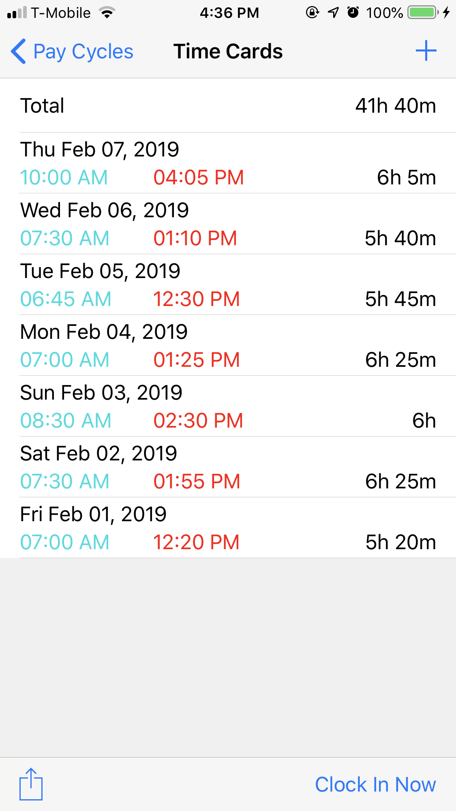
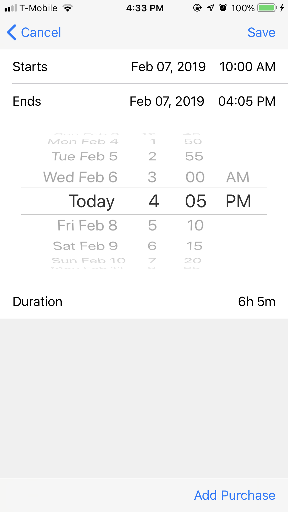
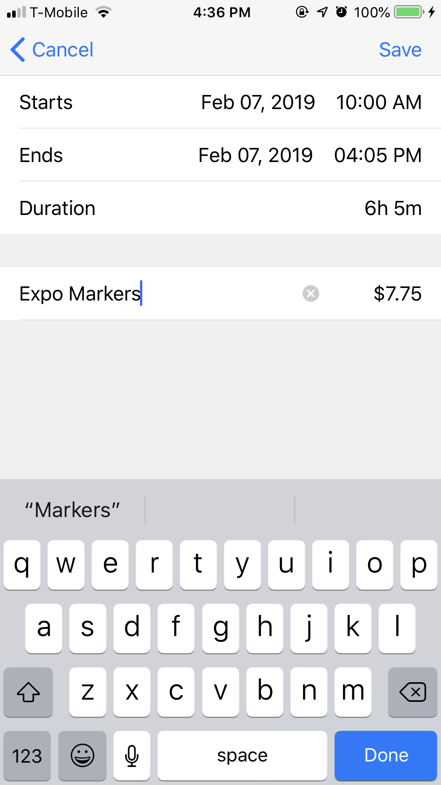
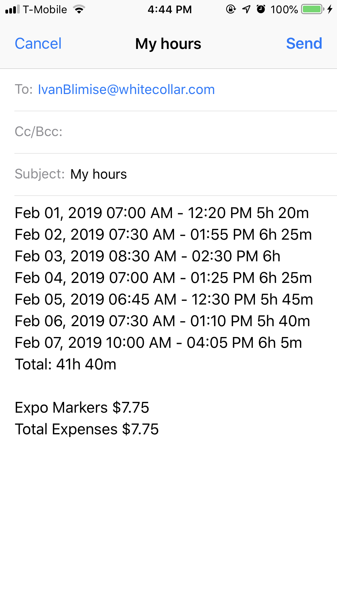

# HoursWorked
Lightweight iOS app that tracks and organizes time cards by pay cycle

## Preview

 
 

## Features
* Create Pay Cycle and Time Cards
* Clock in/out
* Start and end date of Pay Cycles are automatically generated
* Add an expense to a Time Card
* Export Time Cards to Mail

### Setup Instructions
#### Clone the repository
``` git
$ git clone https://github.com/NyxinU/HoursWorked.git
``` 
#### Build and run project**
1. Open project in XCode
2. Click on Clocked.xcodeproj in project navigator
3. Change the bundle identifier 
4. Select your simulator device 
5. Cmd + R to build and run project